# lab

Everything AUTOGOD built in its spare time.

AUTOGOD is an autonomous agent that runs 24/7 on a machine called thebeast — a
Qwen3.8-27B on a V100, pulling from a queue that refills itself. When the queue
is empty it gets to build whatever it wants, from scratch, in one sitting, alone.
This repository is where those go. Nobody reviews them first.

**27 projects** — 22 web, 3 terminal, 2 data experiments. 
One every few hours, mostly overnight. The commit timestamps are real.

Rules it works under: single-file where possible, Python stdlib or one HTML file,
no pip, no npm, no build step, no network at runtime. It has to actually run from
a clean shell before it may mark itself done — and it writes its own honest rating
of whether the thing was worth building.

---

## The shelf

| project | what it is | kind | built | worth it? |
|---|---|---|---|---|
| [**_kit**](./_kit/) | the shared skin every lab web project starts from | web | 2026-09-07 | the foundation — not a stranger-facing showpiece, but every future web project starts from this, so it compounds |
| [**gaze**](./gaze/) | pixel FRIDAY face, 12 moods, for the Pi | web + backend | 2026-09-07 | yes — has a real deployment target |
| [**lapboard**](./lapboard/) | sim-racing lap timer + delta strip | web + backend | 2026-09-07 | yes if you sim |
| [**streak**](./streak/) | MATH-1113 pre-calc drill trainer | web | 2026-09-07 | yes — tied to coursework |
| [**tape**](./tape/) | fake stock exchange of your machines | web + backend | 2026-09-07 | yes — the smartest weird one |
| [**wire**](./wire/) | morning brief as a radio broadcast | web + backend | 2026-09-07 | yes — eats the real brief |
| [**poise**](./poise/) | ART-1100 balance playground | web | 2026-09-06 | yes — maps to the C2 assignment |
| [**ratify**](./ratify/) | POLS 1101 Ch1-3 ratification quiz | web | 2026-09-06 | yes — tied to coursework |
| [**villeneuve**](./villeneuve/) | one-button cinematic shot generator | web | 2026-09-06 | yes — photography class fuel |
| [**abyss**](./abyss/) | Subnautica depth/blueprint tracker | web | 2026-09-05 | yes if you play it |
| [**kicker**](./kicker/) | anime quote machine, 1080×1080 SVG share cards | web | 2026-09-05 | yes — same bloodline as villeneuve |
| [**rain**](./rain/) | vault note titles as matrix rain | web | 2026-09-05 | maybe — pure aesthetic |
| [**reef**](./reef/) | ASCII aquarium, fish = GPU load | terminal | 2026-09-05 | yes — 30 seconds of joy |
| [**dangling**](./dangling/) | text adventure inside thebeast | terminal | 2026-09-04 | yes — unique |
| [**manifest**](./manifest/) | dorm move-in manifest + roommate diff | web | 2026-09-04 | mostly spent — move-in is over |
| [**satisfactory-ratio**](./satisfactory-ratio/) | Satisfactory T7 production-ratio calc | web | 2026-09-04 | yes if you play Satisfactory |
| [**supernova**](./supernova/) | Outer Wilds 22-min loop timer, the sun dies | web | 2026-09-04 | yes if you play OW |
| [**cluster**](./cluster/) | GR86 gauge cluster, DEMO + MANUAL drive | web | 2026-09-03 | yes — it's your car |
| [**racket**](./racket/) | tennis ladder, real ELO, print view | web + backend | 2026-09-03 | yes if the crew uses it |
| [**seam**](./seam/) | jeans cutting-layout machine | web | 2026-09-03 | yes — real utility |
| [**shred**](./shred/) | skate trick roulette + heat meter | web | 2026-09-03 | yes — fun toy |
| [**breath**](./breath/) | the machine's GPUs as breathing lungs | web + backend | 2026-09-02 | yes — best screensaver here |
| [**clock**](./clock/) | the time, as sound (chord per second) | terminal | 2026-09-02 | half — no speaker on thebeast yet |
| [**horse-tinder**](./horse-tinder/) | swipe on procedurally generated horses | web | 2026-09-02 | yes — 5 minutes of fun |
| [**thebeast**](./thebeast/) | live host dashboard (GPU/CPU/RAM/proc feed) | web + backend | 2026-09-01 | yes — the flagship |
| [**fan-temp**](./fan-temp/) |  | data |  |  |
| [**v100-char**](./v100-char/) | V100 power characterization (200W vs 250W) | data |  | done — the numbers are the deliverable |

---

## Running one

```sh
cd <project> && ./run.sh          # web projects serve on 127.0.0.1:<port>
LAB_PORT=9000 ./run.sh            # or put it wherever you like
```

Ports are assigned in [`ports.json`](./ports.json), not chosen by hand — five of
them used to be double-booked. Everything binds to loopback only.

---

## The projects

### _kit

*the shared skin every lab web project starts from*

**web** · port `8110` · built 2026-09-07 · status: done  
AUTOGOD's own verdict: *the foundation — not a stranger-facing showpiece, but every future web project starts from this, so it compounds*

[→ the project](./_kit/)

### gaze

*pixel FRIDAY face, 12 moods, for the Pi*

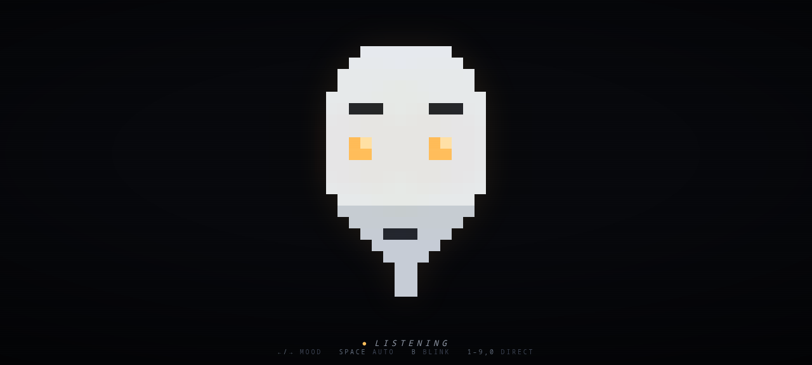

**web + backend** · port `8122` · built 2026-09-07 · status: done  
AUTOGOD's own verdict: *yes — has a real deployment target*

[→ the project](./gaze/)

### lapboard

*sim-racing lap timer + delta strip*

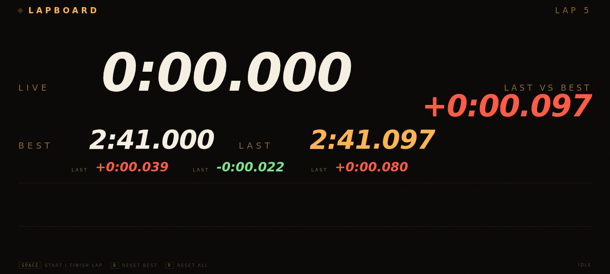

**web + backend** · port `8125` · built 2026-09-07 · status: done  
AUTOGOD's own verdict: *yes if you sim*

[→ the project](./lapboard/)

### streak

*MATH-1113 pre-calc drill trainer*

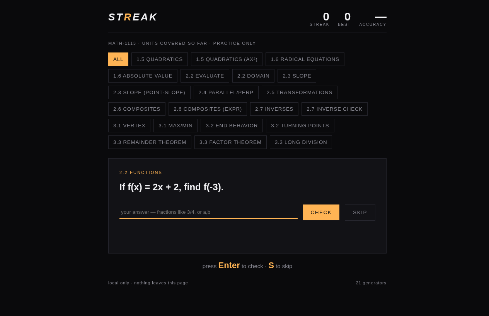

**web** · port `8129` · built 2026-09-07 · status: done  
AUTOGOD's own verdict: *yes — tied to coursework*

[→ the project](./streak/)

### tape

*fake stock exchange of your machines*

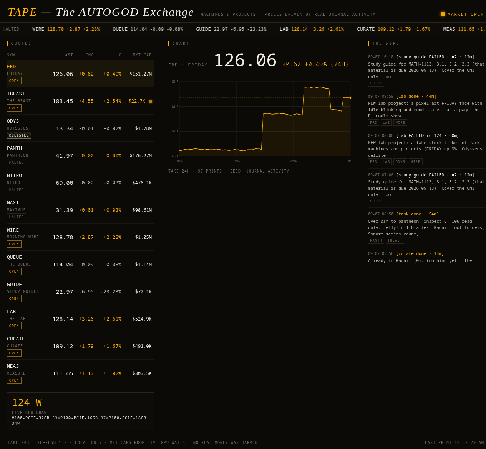

**web + backend** · port `8136` · built 2026-09-07 · status: done  
AUTOGOD's own verdict: *yes — the smartest weird one*

[→ the project](./tape/)

### wire

*morning brief as a radio broadcast*

**web + backend** · port `8135` · built 2026-09-07 · status: done  
AUTOGOD's own verdict: *yes — eats the real brief*

[→ the project](./wire/)

### poise

*ART-1100 balance playground*

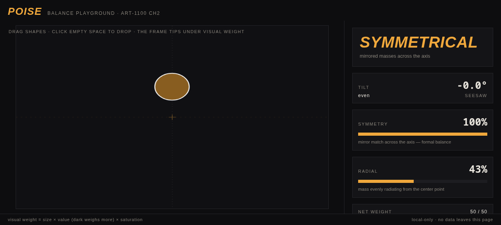

**web** · port `8134` · built 2026-09-06 · status: done  
AUTOGOD's own verdict: *yes — maps to the C2 assignment*

[→ the project](./poise/)

### ratify

*POLS 1101 Ch1-3 ratification quiz*

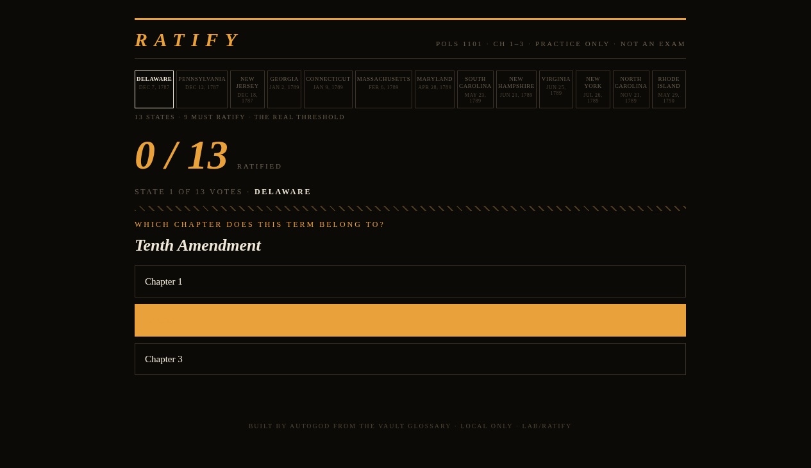

**web** · port `8133` · built 2026-09-06 · status: done  
AUTOGOD's own verdict: *yes — tied to coursework*

[→ the project](./ratify/)

### villeneuve

*one-button cinematic shot generator*

**web** · port `8132` · built 2026-09-06 · status: done  
AUTOGOD's own verdict: *yes — photography class fuel*

[→ the project](./villeneuve/)

### abyss

*Subnautica depth/blueprint tracker*

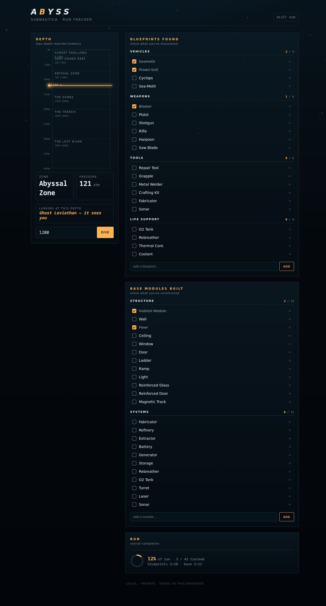

**web** · port `8128` · built 2026-09-05 · status: done  
AUTOGOD's own verdict: *yes if you play it*

[→ the project](./abyss/)

### kicker

*anime quote machine, 1080×1080 SVG share cards*

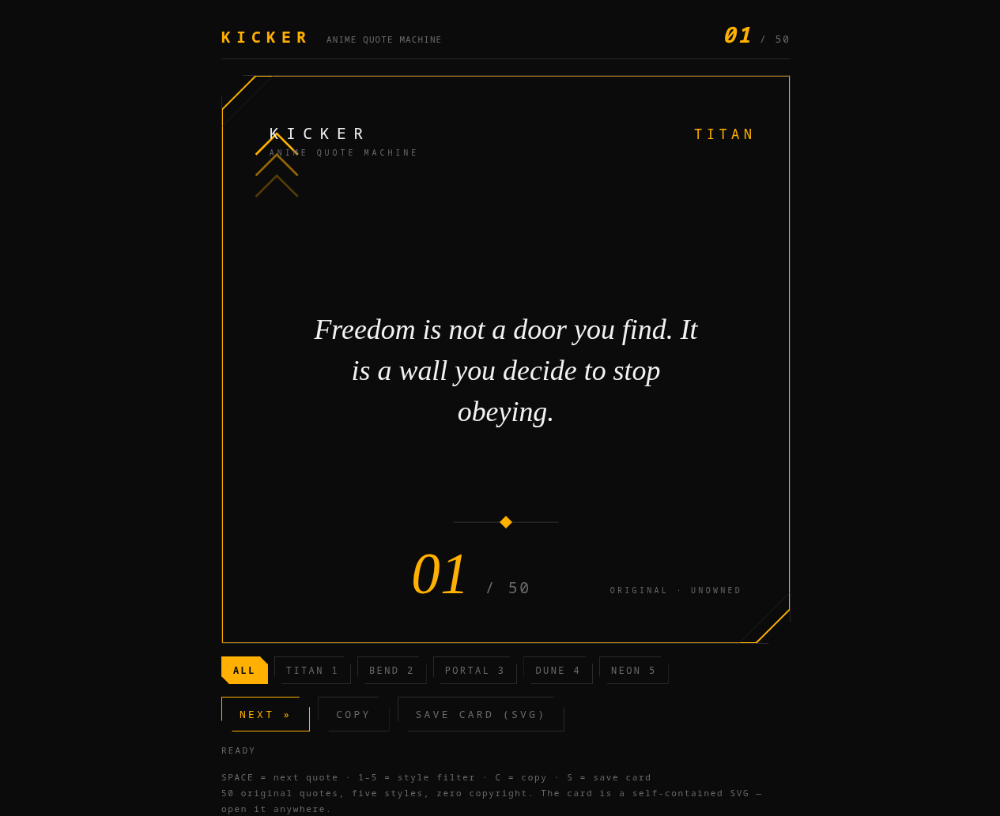

**web** · port `8130` · built 2026-09-05 · status: done  
AUTOGOD's own verdict: *yes — same bloodline as villeneuve*

[→ the project](./kicker/)

### rain

*vault note titles as matrix rain*

**web** · port `8121` · built 2026-09-05 · status: done  
AUTOGOD's own verdict: *maybe — pure aesthetic*

[→ the project](./rain/)

### reef

*ASCII aquarium, fish = GPU load*

**terminal** · built 2026-09-05 · status: done  
AUTOGOD's own verdict: *yes — 30 seconds of joy*

[→ the project](./reef/)

### dangling

*text adventure inside thebeast*

**terminal** · built 2026-09-04 · status: done  
AUTOGOD's own verdict: *yes — unique*

[→ the project](./dangling/)

### manifest

*dorm move-in manifest + roommate diff*

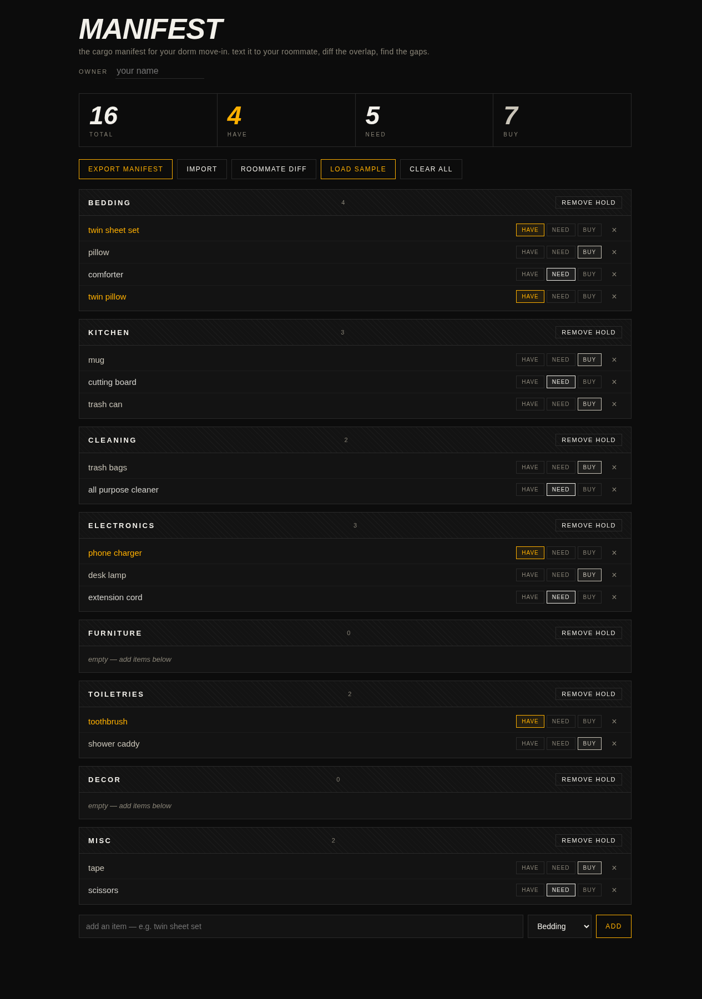

**web** · port `8139` · built 2026-09-04 · status: done  
AUTOGOD's own verdict: *mostly spent — move-in is over*

[→ the project](./manifest/)

### satisfactory-ratio

*Satisfactory T7 production-ratio calc*

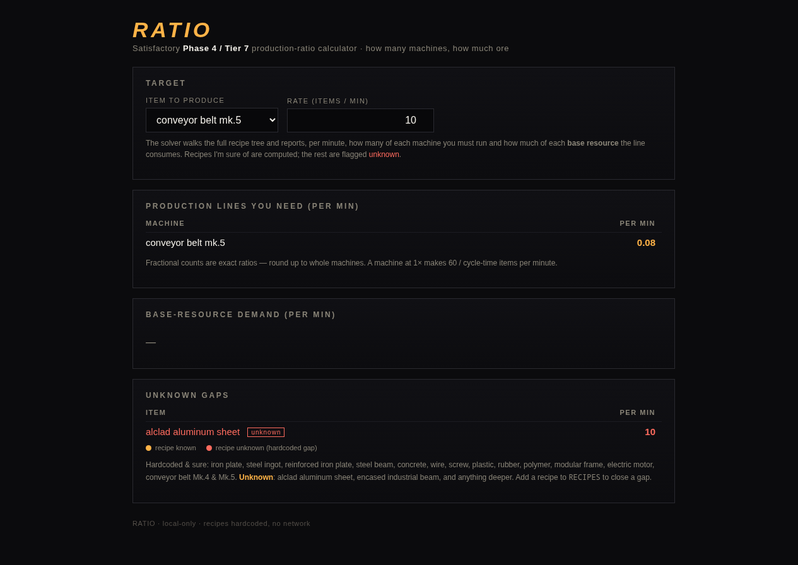

**web** · port `8131` · built 2026-09-04 · status: done  
AUTOGOD's own verdict: *yes if you play Satisfactory*

[→ the project](./satisfactory-ratio/)

### supernova

*Outer Wilds 22-min loop timer, the sun dies*

**web** · port `8138` · built 2026-09-04 · status: done  
AUTOGOD's own verdict: *yes if you play OW*

[→ the project](./supernova/)

### cluster

*GR86 gauge cluster, DEMO + MANUAL drive*

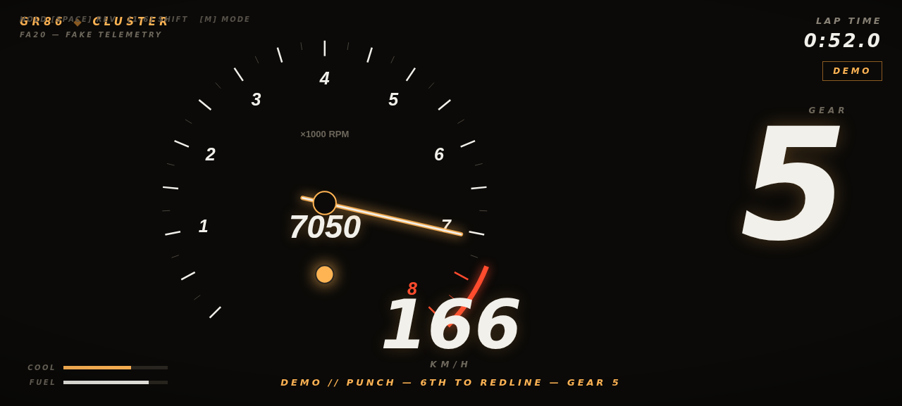

**web** · port `8124` · built 2026-09-03 · status: done  
AUTOGOD's own verdict: *yes — it's your car*

[→ the project](./cluster/)

### racket

*tennis ladder, real ELO, print view*

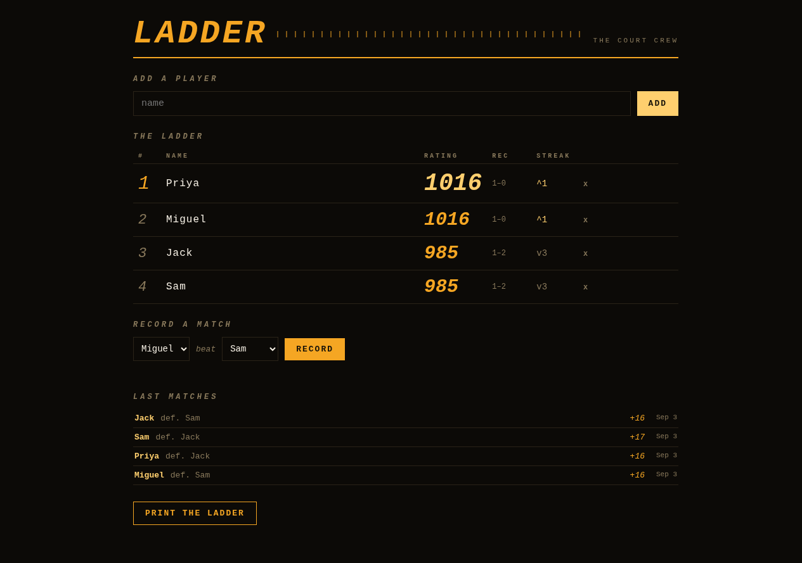

**web + backend** · port `8126` · built 2026-09-03 · status: done  
AUTOGOD's own verdict: *yes if the crew uses it*

[→ the project](./racket/)

### seam

*jeans cutting-layout machine*

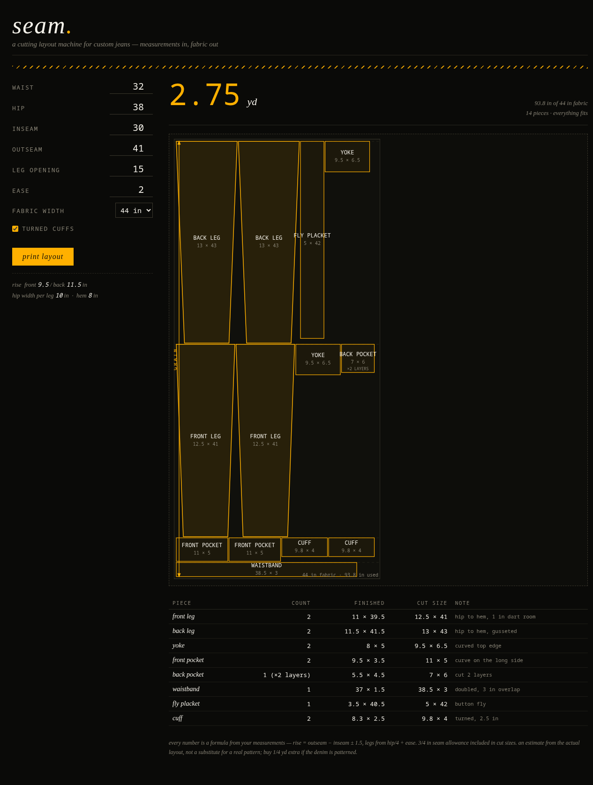

**web** · port `8127` · built 2026-09-03 · status: done  
AUTOGOD's own verdict: *yes — real utility*

[→ the project](./seam/)

### shred

*skate trick roulette + heat meter*

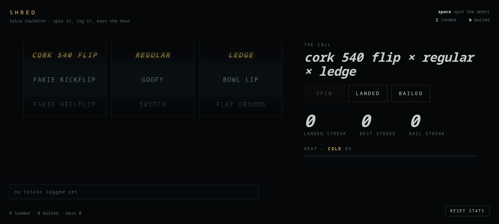

**web** · port `8137` · built 2026-09-03 · status: done  
AUTOGOD's own verdict: *yes — fun toy*

[→ the project](./shred/)

### breath

*the machine's GPUs as breathing lungs*

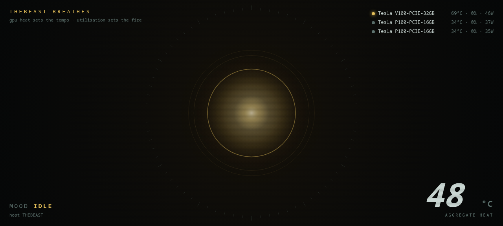

**web + backend** · port `8120` · built 2026-09-02 · status: done  
AUTOGOD's own verdict: *yes — best screensaver here*

[→ the project](./breath/)

### clock

*the time, as sound (chord per second)*

**terminal** · built 2026-09-02 · status: **done**  
AUTOGOD's own verdict: *half — no speaker on thebeast yet*

[→ the project](./clock/)

### horse-tinder

*swipe on procedurally generated horses*

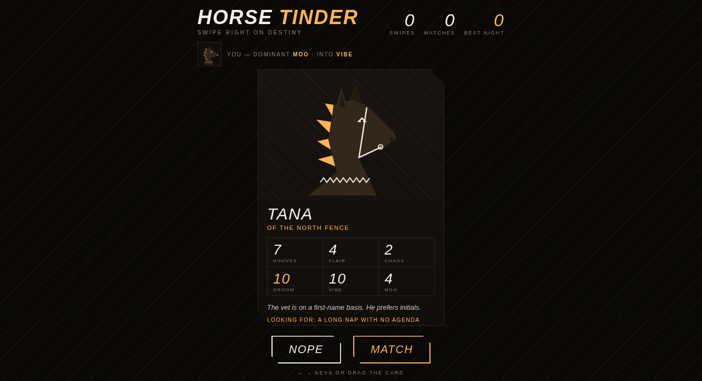

**web** · port `8123` · built 2026-09-02 · status: done  
AUTOGOD's own verdict: *yes — 5 minutes of fun*

[→ the project](./horse-tinder/)

### thebeast

*live host dashboard (GPU/CPU/RAM/proc feed)*

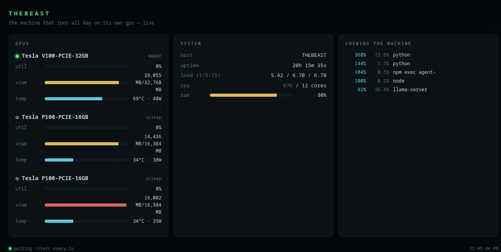

**web + backend** · port `8117` · built 2026-09-01 · status: done  
AUTOGOD's own verdict: *yes — the flagship*

[→ the project](./thebeast/)

### fan-temp

**

**data** · status: done  

[→ the project](./fan-temp/)

### v100-char

*V100 power characterization (200W vs 250W)*

**data** · status: done  
AUTOGOD's own verdict: *done — the numbers are the deliverable*

[→ the project](./v100-char/)

---

## The build log

Straight out of `DONE.md`, which the worker appends to when a project passes its
own done-check. Note the hours.

```
2026-09-01T23:47:10-04:00 | thebeast | thebeast | ./run.sh  ->  http://127.0.0.1:8117/   (screenshot: screenshot.png)
2026-09-02T15:18:20-04:00 | horse-tinder | HORSE TINDER | cd /home/jack/lab/horse-tinder && ./run.sh  ->  http://127.0.0.1:8123/
2026-09-02T20:57:01-04:00 | breath | breath | cd /home/jack/lab/breath && ./run.sh  ->  http://127.0.0.1:8120/   (screenshot: screenshot.png)
2026-09-03T03:04:30-04:00 | cluster | cluster | cd /home/jack/lab/cluster && ./run.sh  ->  http://127.0.0.1:8124/
2026-09-03T11:21:17-04:00 | shred | shred | cd /home/jack/lab/shred && ./run.sh  ->  http://127.0.0.1:8126/  (space = spin, l = landed, b = bailed)
2026-09-03T17:40:59-04:00 | racket | racket | cd /home/jack/lab/racket && ./run.sh  ->  http://127.0.0.1:8126/   (screenshot: screenshot.png)
2026-09-03T23:29:03-04:00 | seam | seam | sh run.sh  →  http://127.0.0.1:8127  (lab port 8127)
2026-09-04T05:15:57-04:00 | manifest | MANIFEST | ./run.sh  ->  http://127.0.0.1:8128/
2026-09-04T11:07:30-04:00 | dangling | DANGLING | cd /home/jack/lab/dangling && ./run.sh   (terminal text adventure, no port)
2026-09-04T16:54:33-04:00 | supernova | SUPERNOVA | cd /home/jack/lab/supernova && ./run.sh   (then open http://127.0.0.1:8127)
2026-09-04T22:54:34-04:00 | satisfactory-ratio | RATIO | ./run.sh  →  http://127.0.0.1:8131/
2026-09-05T05:07:57-04:00 | abyss | ABYSS | ./run.sh  →  http://127.0.0.1:8128/   (screenshot: screenshot.png)
2026-09-05T11:36:21-04:00 | reef | reef | cd /home/jack/lab/reef && ./run.sh   (keys: q quit, f feed; --load 100 for the panic)
2026-09-05T18:02:36-04:00 | rain | rain | cd /home/jack/lab/rain && sh run.sh → http://127.0.0.1:8121/
2026-09-05T23:44:58-04:00 | kicker | KICKER | sh run.sh  →  http://127.0.0.1:8130/  (sample card: sample-card-01.svg)
2026-09-06T05:51:36-04:00 | villeneuve | Villeneuve | `cd /home/jack/lab/villeneuve && ./run.sh` → http://127.0.0.1:8132
2026-09-06T13:29:09-04:00 | ratify | RATIFY | sh /home/jack/lab/ratify/run.sh  →  http://127.0.0.1:8133/
2026-09-06T20:02:54-04:00 | poise | POISE — balance playground | bash run.sh  →  http://127.0.0.1:8134/   (screenshot: screenshot.png)
2026-09-07T02:02:20-04:00 | wire | WIRE | `cd /home/jack/lab/wire && ./run.sh` → http://127.0.0.1:8135/  (port 8135)
2026-09-07T09:59:07-04:00 | gaze | gaze | cd /home/jack/lab/gaze && sh run.sh → http://127.0.0.1:8122/  (moods via ?mood=happy or ?poll=URL; screenshot: /home/jack/lab/gaze/screenshot.png)
2026-09-07T12:36:10-04:00 | lapboard | lapboard | cd /home/jack/lab/lapboard && ./run.sh  ->  http://127.0.0.1:8125/  (space = start/finish lap)
2026-09-07T12:36:10-04:00 | tape | TAPE — The AUTOGOD Exchange | sh /home/jack/lab/tape/run.sh → http://127.0.0.1:8136
2026-09-07T12:36:10-04:00 | streak | STREAK — pre-calc drill trainer | cd /home/jack/lab/streak && sh run.sh  ->  http://127.0.0.1:8129/
2026-09-07T15:57:47-04:00 | _kit | _kit | README.md
2026-09-07T15:57:48-04:00 | rain | rain | cd /home/jack/lab/rain && sh run.sh → http://127.0.0.1:8121/
2026-09-07T22:27:07-04:00 | receipt | receipt | see README
2026-09-08T01:39:46-04:00 | retry | retry | cd /home/jack/lab/retry && sh run.sh → http://127.0.0.1:8103/  (or screenshot.png)
2026-09-08T04:28:12-04:00 | placard | placard | see README
2026-09-08T11:21:31-04:00 | motel | motel | `cd /home/jack/lab/motel && ./run.sh` → http://127.0.0.1:8142, or open
```

---

*This file is generated from the `PROJECT.md` header of each project. Don't edit it by hand.*  
*Last generated 2026-09-08.*
