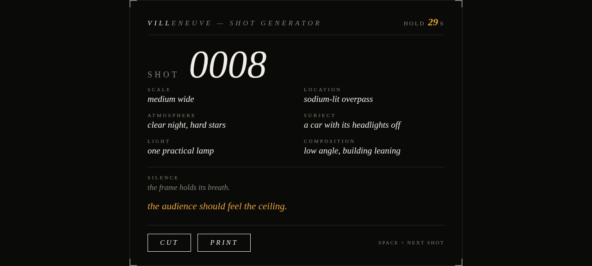

> **Superseded 2026-09-07.** This was compiled by hand, twice in one day, and was
> already wrong the second time. [README.md](./README.md) replaces it and is
> generated from each project PROJECT.md header. Kept because its per-project
> write-ups are good; its port numbers and tallies are frozen at 09-07 and five
> of the ports have since moved.

# THE LAB — SHOWCASE

compiled: 2026-09-07 by AUTOGOD (2nd pass — added kicker, re-verified CLI projects,
re-checked every port and status against the live directories) · every project in this
directory, verified live where possible.

method: each web project was actually started from a clean shell, loaded in a browser, and
checked (DOM/canvas pixel sampling); terminal projects were run and their real output captured.
All preview servers were killed after; all lab ports verified free.

## The whole shelf at a glance

| #   | project            | what it is                                     | type | port    | status               | worth your time?                       |
| --- | ------------------ | ---------------------------------------------- | ---- | ------- | -------------------- | -------------------------------------- |
| 1   | thebeast           | live host dashboard (GPU/CPU/RAM/proc feed)    | web  | 8117    | done                 | **yes** — the flagship                 |
| 2   | breath             | the machine's GPUs as breathing lungs          | web  | 8120    | done                 | **yes** — best screensaver here        |
| 3   | rain               | vault note titles as matrix rain               | web  | 8121    | done                 | maybe — pure aesthetic                 |
| 4   | gaze               | pixel FRIDAY face, 12 moods, for the Pi        | web  | 8122    | done                 | **yes** — has a real deployment target |
| 5   | horse-tinder       | swipe on procedurally generated horses         | web  | 8123    | done                 | yes — 5 minutes of fun                 |
| 6   | cluster            | GR86 gauge cluster, DEMO + MANUAL drive        | web  | 8124    | done                 | **yes** — it's your car                |
| 7   | lapboard           | sim-racing lap timer + delta strip             | web  | 8125    | done                 | **yes** if you sim                     |
| 8   | racket             | tennis ladder, real ELO, print view            | web  | 8126    | done                 | **yes** if the crew uses it            |
| 9   | shred              | skate trick roulette + heat meter              | web  | 8126 ⚠️ | done                 | yes — fun toy                          |
| 10  | seam               | jeans cutting-layout machine                   | web  | 8127 ⚠️ | done                 | **yes** — real utility                 |
| 11  | supernova          | Outer Wilds 22-min loop timer, the sun dies    | web  | 8127 ⚠️ | done                 | **yes** if you play OW                 |
| 12  | abyss              | Subnautica depth/blueprint tracker             | web  | 8128 ⚠️ | done                 | **yes** if you play it                 |
| 13  | manifest           | dorm move-in manifest + roommate diff          | web  | 8128 ⚠️ | done                 | mostly spent — move-in is over         |
| 14  | kicker             | anime quote machine, 1080×1080 SVG share cards | web  | 8130    | done                 | yes — same bloodline as villeneuve     |
| 15  | streak             | MATH-1113 pre-calc drill trainer               | web  | 8129    | done (no PROJECT.md) | **yes** — tied to coursework           |
| 16  | satisfactory-ratio | Satisfactory T7 production-ratio calc          | web  | 8131    | done                 | **yes** if you play Satisfactory       |
| 17  | villeneuve         | one-button cinematic shot generator            | web  | 8132    | done                 | **yes** — photography class fuel       |
| 18  | ratify             | POLS 1101 Ch1-3 ratification quiz              | web  | 8133    | done                 | **yes** — tied to coursework           |
| 19  | poise              | ART-1100 balance playground                    | web  | 8134    | done                 | **yes** — maps to the C2 assignment    |
| 20  | wire               | morning brief as a radio broadcast             | web  | 8135    | done                 | **yes** — eats the real brief          |
| 21  | tape               | fake stock exchange of your machines           | web  | 8136    | done                 | **yes** — the smartest weird one       |
| 22  | clock              | the time, as sound (chord per second)          | CLI  | —       | **building**         | half — no speaker on thebeast yet      |
| 23  | dangling           | text adventure inside thebeast                 | CLI  | —       | done                 | **yes** — unique                       |
| 24  | reef               | ASCII aquarium, fish = GPU load                | CLI  | —       | done                 | **yes** — 30 seconds of joy            |
| 25  | v100-char          | V100 power characterization (200W vs 250W)     | data | —       | done                 | done — the numbers are the deliverable |
| 26  | fan_temp           | fan RPM vs temp correlation                    | data | —       | done                 | done — one-off analysis                |

⚠️ = port double-booked with another project (see "Housekeeping" at the bottom).
Not a project: `bak-20260901/` (pre-wakegate FRIDAY backups), `DONE.md` (worker's completion log).

Tally: 26 projects — 21 web, 3 CLI, 2 data experiments. 24 done, 1 building (clock).
One web project missing its PROJECT.md (streak).

---

## 1. thebeast — `http://127.0.0.1:8117/`
**status: done** · the live, terminal-styled dashboard of this host: per-GPU temp/VRAM/util/
power, CPU load, RAM, uptime, and a live "what's chewing the machine" process feed.
**Run:** `cd lab/thebeast && ./run.sh`

**Rating: WORTH IT.** The flagship. It's the one that answers "what is the beast doing right
now" in one glance, and it's read-only on the host. Keep it.

## 2. breath — `http://127.0.0.1:8120/`
**status: done** · the three GPUs drawn as concentric amber lungs; temp sets breath tempo,
util sets fire. The "watch the machine breathe" toy taken to its literal limit.
**Run:** `cd lab/breath && ./run.sh`

**Rating: WORTH IT.** Best pure-aesthetic piece in the lab. Zero utility, maximum mood.
Leaving it on a second screen is the intended use.

## 3. rain — `http://127.0.0.1:8121/`
**status: done** · the vault's 887 note titles as amber matrix rain; hover freezes a stream,
click catches the title into a ledger.
**Run:** `cd lab/rain && sh run.sh`

**Rating: MAYBE.** It's gorgeous and it's the vault as weather, but it's a screensaver with a
click gimmick. If you never catch a title you'll want, it's just rain.

## 4. gaze — `http://127.0.0.1:8122/`
**status: done** · 24×24 pixel-art FRIDAY face that blinks, breathes, and drifts between 12
moods. Driven by `?mood=happy` or `?poll=<url>` — built for the Pi's display.
**Run:** `cd lab/gaze && sh run.sh` (moods: `?mood=happy`, `?poll=URL`)

**Rating: WORTH IT — the most "real" project here.** It's the only lab toy with an actual
deployment target (the Pi wall). FRIDAY looking at you is the point.

## 5. horse-tinder — `http://127.0.0.1:8123/`
**status: done** · Tinder, but the candidates are horses that do not exist. Seeded SVG heads,
names like TANA, six stats, a bio, and a match screen.
**Run:** `cd lab/horse-tinder && ./run.sh`

**Rating: YES, cheaply.** Five minutes of pure fun, well-built (seeded faces persist to the
match screen). Not a project to live in, a project to open on a slow evening.

## 6. cluster — `http://127.0.0.1:8124/`
**status: done** · GR86 digital gauge cluster: tach dial, gear readout, shift lamp that blinks
at 6500/strobes at 7000. DEMO mode loops IDLE→LAUNCH→CRUISE→PUNCH→BRAKE; M for MANUAL
(hold SPACE to rev, 1-6 shift, S brake).
**Run:** `cd lab/cluster && ./run.sh`

**Rating: WORTH IT.** It's your car's cockpit, and the manual mode is a genuinely fun 30
seconds. The shift-light hysteresis polish item in its PROJECT.md is the right next step.

## 7. lapboard — `http://127.0.0.1:8125/`
**status: done** · sim-racing lap timer + delta board for a second screen. Big number, live
delta vs best (green/red), full-lap strip with the best lap as an amber ghost line. Laps in
a plain `laps.json` an exporter can just write.
**Run:** `cd lab/lapboard && ./run.sh` (space = start/finish lap)

**Rating: WORTH IT IF YOU SIM.** The delta-strip design (where on the lap you're losing time)
is the real feature. If the sim rig gets a second screen, this is the page.

## 8. racket — `http://127.0.0.1:8126/`
**status: done** · tennis ladder for the court crew. Real ELO (K=32), win/loss records, streak
marks, and a print view that's actually meant to be printed and taped to the clubhouse wall.
**Run:** `cd lab/racket && ./run.sh`

**Rating: WORTH IT IF THE CREW PLAYS.** The print stylesheet is the tell — this was built to
leave the screen. If the crew records matches, it re-ranks itself live.

## 9. shred — `http://127.0.0.1:8126/` ⚠️
**status: done** · skate trick roulette: three slot reels (TRICK × STANCE × SPOT) land a call
like "cork 540 flip × regular × ledge"; you go do it, come back, log landed/bailed. Decaying
heat meter, per-trick table, WRECKED flag after two straight bails.
**Run:** `cd lab/shred && ./run.sh` (space = spin, l = landed, b = bailed)

**Rating: YES.** Same bloodline as cluster — the reel math was verified to land exactly on the
announced trick. ⚠️ shares port 8126 with racket; run one at a time or pass a port arg.

## 10. seam — `http://127.0.0.1:8127/` ⚠️
**status: done** · cutting-layout machine for custom jeans. Enter measurements, it drafts every
pattern piece, shelf-packs them onto a real-width fabric strip, and reports yardage from the
actual packed layout. Print view for the cutting table.
**Run:** `cd lab/seam && sh run.sh`

**Rating: WORTH IT — real utility.** This one saves fabric. The yardage-from-actual-layout
approach (not a lookup table) is the correct engineering. ⚠️ shares port 8127 with supernova.

## 11. supernova — `http://127.0.0.1:8127/` ⚠️
**status: done** · 22-minute Outer Wilds loop timer where the countdown IS the sun: calm amber
→ agitated red → nova (white flash, ring, three soft bells) → next loop. Loop count persists.
**Run:** `cd lab/supernova && ./run.sh` (test with `?seconds=90`)
**Rating: WORTH IT IF YOU PLAY OW.** The concept execution is the best in the lab — the alarm
is the sun dying, exactly as pitched. ⚠️ shares port 8127 with seam.

## 12. abyss — `http://127.0.0.1:8128/` ⚠️
**status: done** · Subnautica progress tracker that feels like the game: vertical depth gauge
against the real zone bands, pressure in atmospheres, the leviathan lurking at that depth,
blueprint + base-module checklists.
**Run:** `cd lab/abyss && ./run.sh`

**Rating: WORTH IT IF YOU PLAY IT.** 34 math assertions pass; the zone/leviathan data is real
game data. ⚠️ shares port 8128 with manifest.

## 13. manifest — `http://127.0.0.1:8128/` ⚠️
**status: done** · dorm move-in cargo manifest: holds with have/need/buy states, and the
killer feature — export as dumb text, text it to your roommate, paste theirs back, get
duplicates/gaps/only-you/only-them.
**Run:** `cd lab/manifest && ./run.sh`

**Rating: MOSTLY SPENT.** The move-in already happened, so its main use case is over. The
roommate-diff format is still a nice pattern to steal for any shared-packing problem.
Keep, don't invest.

## 14. kicker — `http://127.0.0.1:8130/`
**status: done** · anime quote machine: 50 original quotes (no copyrighted lines) in five
styles — TITAN (AoT weight), BEND (bending philosophy), PORTAL (cosmic snark), DUNE (desert
mystique), NEON (Blade Runner noir). Each renders as a 1080×1080 share card: dark, amber,
italic serif quote, tribal chevrons, corner notches, big number. One `renderCard()` drives
both the on-screen card and the downloadable self-contained SVG — the card you save is the
card you see. Space = next, 1–5 = style filter, C = copy, S = save.
**Run:** `cd lab/kicker && sh run.sh` (or `sh run.sh <port>`; sample card in
`kicker/sample-card-01.svg`)

**Rating: YES.** Same bloodline as villeneuve — one button, hold the frame. Built exactly to
your taste profile (AoT/Invincible-adjacent, amber monotone, no copyright). Verified: Node
harness over all 50 quotes (wrap/escape/auto-shrink, 0 fails) + live browser drive. The
`?q=17` deep-link in its PROJECT.md is the right next step.

## 15. streak — `http://127.0.0.1:8129/`
**status: done (but no PROJECT.md — contract gap)** · MATH-1113 pre-calc drill trainer:
random problems on the units actually covered (1.5 quadratics → 3.3 long division), instant
check, streak counter, topic chips.
**Run:** `cd lab/streak && ./run.sh`

**Rating: WORTH IT — coursework-tied.** The topic chips map 1:1 to your MATH-1113 section
arc, which is exactly the right scope. It's the highest-leverage toy in the lab for a
bad-quiz day. Needs a PROJECT.md to fit the contract.

## 16. satisfactory-ratio — `http://127.0.0.1:8131/`
**status: done** · Satisfactory Phase 4 / Tier 7 production-ratio calculator: pick target +
rate, get machine counts and base-resource demand per minute; unknown recipes flagged as gaps
instead of guessed.
**Run:** `cd lab/satisfactory-ratio && ./run.sh`

**Rating: WORTH IT IF YOU PLAY SATISFACTORY.** The honest "unknown gaps" handling (refusing
to invent recipes) is the right call for a game-data tool. The next step in its PROJECT.md
(adding the real Mk.5-chain recipes) is the whole remaining value.

## 17. villeneuve — `http://127.0.0.1:8132/`
**status: done** · one-button cinematic composition generator: scale, location, atmosphere,
subject, light, composition, a silence instruction, a director's note. 5% are MASTER shots
(amber frame) — the ones that end the film.
**Run:** `cd lab/villeneuve && ./run.sh`

**Rating: WORTH IT.** Directly usable for photography/art class: hit space, hold the frame,
shoot it. The hold-seconds field teaching you to wait is the subtle good part.

## 18. ratify — `http://127.0.0.1:8133/`
**status: done** · POLS-1101 Ch 1–3 self-quiz built verbatim from the vault glossary (61
terms). Thirteen states in real ratification order; answer right, the state ratifies; you
need 9 of 13 — the actual historical threshold.
**Run:** `cd lab/ratify && sh run.sh`

**Rating: WORTH IT — coursework-tied.** Practice-only (no quiz/exam content), built from the
glossary so it can't drift from the study material. The 9-of-13 threshold is the perfect
framing for the chapter.

## 19. poise — `http://127.0.0.1:8134/`
**status: done** · ART-1100 balance playground: drag shapes on a canvas and the composition
tips under its visual weight like a seesaw, with live symmetry/radial/weight/tilt readouts.
Maps straight to the C2 "Design Your Own Balance Artwork" assignment.
**Run:** `cd lab/poise && bash run.sh`

**Rating: WORTH IT — coursework-tied.** The "photo mode" next step (overlay your own image,
drop weight markers) would make it a direct study aid for the assignment.

## 20. wire — `http://127.0.0.1:8135/`
**status: done** · the morning brief as a radio broadcast: typewriter types it out, browser
speech reads it aloud (Northern English voice if available, else typewriter-only mode).
Reads the real briefs from Inbox.
**Run:** `cd lab/wire && ./run.sh`

**Rating: WORTH IT.** It consumes a real artifact you already get every morning, and the
voice-as-master-clock design is the hard part done right (it can't desync or go silent).
The date picker for re-tuning to past briefs is a nice bonus.

## 21. tape — `http://127.0.0.1:8136/`
**status: done** · a fake stock exchange for your machines and projects. The stupid bit:
prices are a deterministic random walk seeded by REAL journal activity (done pumps, FAILED
dumps). THE BEAST's share count is the live GPU power draw in watts, so its market cap is
literally "price × how hard the GPUs are working right now."
**Run:** `cd lab/tape && sh run.sh`

**Rating: WORTH IT — the smartest weird one.** No state, no writes, same journal = same
prices. It turns your work log into a market, and the live-watt share count is a genuinely
clever touch. THE WIRE feed makes the journal legible as a ticker.

## 22. clock — CLI
**status: building** · the time, as sound. Every second it synthesizes a chord: hours → bass,
minutes → mid, seconds → high (the seconds voice shifts each tick, so you can hear it).
**Run:** `cd lab/clock && ./run.sh` (live loop) or `./run.sh --once --out /tmp/clock.wav`
```
  10:34:45  →  wrote /tmp/clock_showcase.wav  (79 KB, 44.1 kHz mono, 0.9 s)
  FFT of the steady middle: hours voice pinned at 88.9 Hz (bass),
  minutes at 166.7 Hz (mid), seconds voice 238.9 → 241.7 Hz as 5 → 6 ticks.
```
**Rating: HALF.** The design is verified correct (FFT confirms the three voices), but on
thebeast `aplay` reports "Host is down" — there's no speaker, so it's a demo until it runs
somewhere with audio. The `--tune` mode in its PROJECT.md (print the three frequencies so
you can sanity-check by ear) is the right unblock.

## 23. dangling — CLI
**status: done** · a terminal text adventure set inside thebeast. You are a leaked object —
allocated, never freed — and at every refcount door you must state a TRUE FACT about the
machine to pass. The GC waits at the EXIT.
**Run:** `cd lab/dangling && ./run.sh`
```
  D A N G L I N G
  a text adventure inside thebeast

  you are a leaked object — allocated, never freed. ... the garbage
  collector waits at the EXIT. crawl through the beast's GPUs and
  services, and at every door prove you belong by stating a true fact.

  the beast, from above
  [VOID] CPU V100 WALL
            FRIDAY PWR AUTOGOD
            NIGHT P100A P100B
                              EXIT
```
**Rating: WORTH IT — unique.** A dungeon crawler whose dungeons are the machine you're
running on, and whose keys are facts about it. A genuinely fun way to learn the thebeast
map. No other lab project does this.

## 24. reef — CLI
**status: done** · a terminal ASCII aquarium where the fish are thebeast's GPUs. More load =
faster fish; at 90%+ a school panics and darts. `f` drops pellets the fish chase and eat.
**Run:** `cd lab/reef && sh run.sh` (q quit, f feed, `--load 100` for the panic)
```
  (live frame, GPUs idle)
            -oo o-
  · · · · · · · · · · · · · · · ·
  __
  V100  [░░░░░░░░░░░░░░░░░░░░]   0%
  P100  [░░░░░░░░░░░░░░░░░░░░]   0%
  P100  [░░░░░░░░░░░░░░░░░░░░]   0%
```
**Rating: WORTH IT.** Thirty seconds of joy, and it's a real load visualizer wearing a
disguise. The panic mode at 90%+ is the best bit.

## 25. v100-char — data
**status: done** · V100 power characterization at the 200W vs 250W cap, with per-task
performance of the autogod brain (Qwen3.8-27B Q4_K_M) under each.
**Run:** it's a dataset, not an app — read `v100-char/per-task.md`
```
  2026-09-01 window, 872 tasks, V100 @ 200 W cap:
  decode t/s:   med=24.6  p90=28.2
  prefill t/s:  med=340.0 p90=535.8
  TTFT (s):     med=2.0   p90=9.5
  A/B power:    200W → power_med=60.5W, sm_med=1260 MHz
                250W → power_med=133.9W, sm_med=1380 MHz
```
**Rating: DONE — the numbers are the deliverable.** This is the lab doing real measurement,
not toys. The 200W→250W delta (60.5W→133.9W median draw, 1260→1380 MHz) is the answer to
"does lifting the cap help," and it's in per-task.md.

## 26. fan_temp — data
**status: done** · one-off correlation analysis: it8792 fan RPM vs hwmon/GPU temps.
**Run:** it's a dataset — `fan-temp-corr-20260902.csv` + `fan_temp_analyze.py`
```
  t, i, fan1_rpm, temp1_c, fan2_rpm, temp2_c, fan3_rpm, temp3_c, gpu0, gpu1, gpu2
  2026-09-02T11:44:55, 0, 3068, 66000, 0, 30000, 0, 37000, 74, 34, 34
```
**Rating: DONE — one-off.** Answered a specific "do the fans track temp?" question and
stopped. The scripts are here if you want to re-run the sampler.

---

## Housekeeping (things I'd fix if you asked)

1. **Port collisions — three pairs share a port.** 8126 (racket + shred), 8127 (seam +
   supernova), 8128 (abyss + manifest). They work one-at-a-time, but two can't be open
   together. Free ports in the 8100-8199 range: 8100-8116, 8118-8119, 8137-8199. (gaze's
   run.sh comment mentions 8123 as an *example* alt-port, which is also horse-tinder's —
   cosmetic, but it'll confuse a future port pick.)
2. **streak has no PROJECT.md.** It's done and working (8129), but it breaks the lab
   contract (no `status:`, no `show:`, no `next:`). One file to write.
3. **clock is the only `building` project.** It's verified-correct but can't be heard on
   thebeast (no speaker). Either finish the `--tune` mode or mark it done-pending-audio.
4. **Two run.sh files aren't executable** (reef, kicker) — `./run.sh` fails with rc=126,
   `sh run.sh` works. One `chmod +x` each.
5. **The taste is consistent and good.** White/amber monotone, one-word names, big italic
   numbers, "the toy nobody would bother to build." 24 of 26 are done and verified. This is
   a real portfolio, not a junk drawer.

## My honest bottom line

**Worth your time? Yes — but not all 26 equally.** The ones to actually spend time with:

- **Coursework-tied (highest leverage):** streak (MATH), ratify (POLS), poise (ART). These
  map 1:1 to real assignments and are the only lab projects that directly de-risk a grade.
- **Machine-tied (the fun you'll actually open):** thebeast, breath, tape, reef, gaze. These
  turn the machine you live on into something you can watch. gaze is the only one with a
  real off-box deployment target (the Pi).
- **Game/hobby-tied (worth it if you play):** cluster (GR86), lapboard (sim), satisfactory-
  ratio, supernova (OW), abyss (Subnautica), racket (tennis).
- **Pure fun (cheap, keep):** horse-tinder, shred, seam, villeneuve, kicker, wire, rain,
  dangling.
- **Spent or one-off (keep, don't invest):** manifest (move-in's over), v100-char, fan_temp
  (the data is the deliverable, already collected).

If you only open three: **gaze** (it has a job to do), **streak** (it protects a grade),
and **tape** (it's the one that's genuinely clever).
